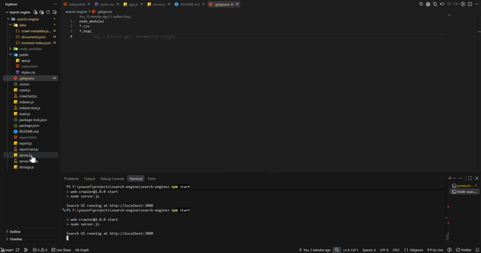

# ⚡ Mini Search Engine & Web Crawler

[](https://nodejs.org/)
[](https://nodejs.org/docs/latest/api/modules.html)
[](https://github.com/jsdom/jsdom)
[](https://jestjs.io/)
[](https://nodejs.org/api/http.html)
[](https://en.wikipedia.org/wiki/Tf%E2%80%93idf)
[](LICENSE)

A high-performance, full-text mini search engine and web crawler implemented entirely in modern JavaScript from first principles.

The system autonomously crawls web domains (configured out of the box for MDN Web Docs), parses and sanitizes raw HTML documents, calculates an inbound link graph, indexes extracted content into a persistent JSON inverted index, and ranks search queries in real time using a weighted **TF-IDF (Term Frequency-Inverse Document Frequency)** vector space retrieval model. It features a zero-dependency local Node.js HTTP server and search API, an interactive dark-mode web interface with live debounced search and latency metrics, a terminal CLI search utility, and an automated SEO/broken link reporting suite that generates CSV spreadsheets and interactive Chart.js audit dashboards.

---

## 🧭 Table of Contents

- [⚡ Mini Search Engine \& Web Crawler](#-mini-search-engine--web-crawler)
  - [🧭 Table of Contents](#-table-of-contents)
  - [🎬 Demo \& Visual Showcase](#-demo--visual-showcase)
  - [✨ Key Features](#-key-features)
  - [🏛️ System Architecture \& Data Flow](#️-system-architecture--data-flow)
    - [High-Level Pipeline](#high-level-pipeline)
    - [Corpus \& Index Schemas](#corpus--index-schemas)
  - [🔬 In-Depth Technology Deep-Dive](#-in-depth-technology-deep-dive)
    - [1. Node.js Runtime \& Asynchronous Concurrency Model](#1-nodejs-runtime--asynchronous-concurrency-model)
    - [2. JSDOM Headless HTML Parser \& Content Sanitizer](#2-jsdom-headless-html-parser--content-sanitizer)
    - [3. Information Retrieval (IR) Engine \& TF-IDF Ranking](#3-information-retrieval-ir-engine--tf-idf-ranking)
      - [A. Text Normalization \& Stop-Word Filtering](#a-text-normalization--stop-word-filtering)
      - [B. Multi-Field Document Weighting](#b-multi-field-document-weighting)
      - [C. The Inverted Index Structure](#c-the-inverted-index-structure)
      - [D. Mathematical Formulation of TF-IDF](#d-mathematical-formulation-of-tf-idf)
      - [E. Dynamic Contextual Snippet Generator](#e-dynamic-contextual-snippet-generator)
    - [4. Graph-Aware Web Crawler \& Link Auditor](#4-graph-aware-web-crawler--link-auditor)
    - [5. Zero-Dependency Native HTTP Server \& REST API](#5-zero-dependency-native-http-server--rest-api)
    - [6. Modern Frontend Architecture](#6-modern-frontend-architecture)
    - [7. Analytics \& Audit Reporting Engine](#7-analytics--audit-reporting-engine)
    - [8. Automated Testing Infrastructure with Jest](#8-automated-testing-infrastructure-with-jest)
  - [📂 Project Directory Structure](#-project-directory-structure)
  - [⚙️ Prerequisites \& Installation](#️-prerequisites--installation)
  - [🚀 Quickstart \& Usage Guide](#-quickstart--usage-guide)
    - [Step 1: Crawl and Build the Search Corpus](#step-1-crawl-and-build-the-search-corpus)
    - [Step 2: Launch the Web UI \& Search API](#step-2-launch-the-web-ui--search-api)
    - [Step 3: Query via Command-Line Interface (CLI)](#step-3-query-via-command-line-interface-cli)
    - [Step 4: Generate Link Audits \& Visual Reports](#step-4-generate-link-audits--visual-reports)
  - [🔌 REST API Reference](#-rest-api-reference)
    - [1. Search Query Endpoint](#1-search-query-endpoint)
    - [2. Corpus Statistics Endpoint](#2-corpus-statistics-endpoint)
  - [🧪 Test Suite Execution](#-test-suite-execution)
  - [💡 Tips, Notes \& Troubleshooting](#-tips-notes--troubleshooting)
  - [📄 License](#-license)

---

## 🎬 Demo & Visual Showcase

[](public/Record_2026_08_26_11_09_48_286.mp4)

> 📹 **[Click here to watch the full demo recording (MP4 video)](public/Record_2026_08_26_11_09_48_286.mp4)** showing the crawler execution, instant UI search with millisecond latency metrics, and ranked results.

[⬆ Back to Top](#-table-of-contents)

---

## ✨ Key Features

- **Concurrent Async Web Crawler**: Asynchronous fetch queue with configurable concurrency bounds (`maxConcurrency`) and page caps (`maxPages`) to efficiently ingest web pages without overloading targets.
- **Scope & URL Hygiene**: Automatic normalization (stripping anchors, query strings, and trailing slashes) and domain/path prefix boundary scoping to eliminate duplicate crawls, infinite redirect loops, and crawler traps.
- **Headless DOM Extraction via JSDOM**: Strips boilerplate tags (`<script>`, `<style>`, `<nav>`, `<footer>`, `<header>`, `<aside>`, `<form>`) and selectively extracts OpenGraph/Twitter card metadata, semantic titles, headings hierarchy, and body text.
- **Persistent Inverted Index**: Generates indexed dictionary files in JSON mapping unique normalized terms to document frequencies and postings entries.
- **Weighted TF-IDF Scoring**: Multi-field document boosting (Title $4\times$, Description $3\times$, Headings $2\times$, Content $1\times$) paired with smoothed logarithmic Inverse Document Frequency ($IDF$) for high-precision ranking.
- **Dynamic Contextual Snippets**: Proximity-aware windowing algorithm extracts query-focused ~220-character excerpts around matching tokens for search results.
- **Inbound Link & Broken Link Auditing**: In-memory graph tracking computes inbound link references per document and detects HTTP 4xx/5xx failures with exact source attribution.
- **Zero-Dependency Native HTTP Server**: Built solely with Node's native `http` and `fs` modules—no Express, Koa, or external server dependencies. Includes secure path traversal guards and automatic MIME resolution.
- **Reactive Dark-Mode Search UI**: Pure Vanilla JavaScript browser application featuring 250ms input debouncing, request cancellation via `AbortController`, sub-10ms search benchmark timers, and keyboard navigation.
- **Multi-Format Report Generator**: Exports link audits and broken link logs to console tables, Excel-compatible CSVs (`report.csv`, `broken_links.csv`), and interactive dark-themed HTML dashboards (`report.html`) powered by Chart.js.
- **Rigorous Automated Test Suite**: 23 Jest unit and integration tests covering the crawler, inverted indexer, TF-IDF scoring, HTTP routes, and reporting logic.

[⬆ Back to Top](#-table-of-contents)

---

## 🏛️ System Architecture & Data Flow

### High-Level Pipeline

The project connects ingestion, indexing, and retrieval across discrete decoupled modules:

```mermaid
flowchart TD
    A[Seed URL / Web Site] -->|crawlSite| B[Async Concurrent Crawler]
    B -->|URL Normalization & Scope Check| C{In Scope?}
    C -->|No| D[Discard / Skip]
    C -->|Yes| E[Fetch HTML & Detect Broken Links]
    E -->|JSDOM Parser| F[Sanitize HTML & Extract Document Fields]
    F -->|Count Inbound Edges| G[documents.json]
    G -->|buildInvertedIndex| H[Tokenizer & Stop-Word Filter]
    H -->|Field Weighting & DF/IDF Math| I[inverted-index.json]
    B -->|Metadata & Inbound Counts| J[crawl-metadata.json]
    
    subgraph Storage Layer
        G
        I
        J
    end

    subgraph Query & Serving Layer
        K[Native HTTP Server<br/>server.js] -->|loadSearchData| Storage Layer
        L[Web Browser UI<br/>public/app.js] -->|GET /api/search| K
        L -->|GET /api/stats| K
        M[CLI Search Tool<br/>main.js] -->|searchDocuments| Storage Layer
        K -->|TF-IDF Scoring & Snippet Windowing| L
        M -->|Ranked Output & Snippets| N[Terminal Output]
    end
```

### Corpus & Index Schemas

The search corpus is stored locally in the `data/` directory across three clean JSON schemas:

1. **`data/documents.json`**: An array of structured document objects:
   ```json
   {
     "id": 1,
     "url": "https://developer.mozilla.org/en-US/docs/Web/JavaScript",
     "title": "JavaScript",
     "description": "JavaScript (JS) is a lightweight interpreted...",
     "headings": ["JavaScript", "Beginner's tutorials", "Reference"],
     "content": "JavaScript is a programming language...",
     "inboundLinks": 50
   }
   ```

2. **`data/inverted-index.json`**: The complete inverted index and term statistics:
   ```json
   {
     "schemaVersion": 1,
     "createdAt": "2026-08-26T07:35:53.720Z",
     "algorithm": "tf-idf",
     "documentCount": 50,
     "termCount": 4876,
     "documentLengths": { "1": 768, "2": 471 },
     "terms": {
       "array": {
         "documentFrequency": 18,
         "idf": 1.986133,
         "postings": [
           {
             "documentId": 1,
             "count": 6,
             "termFrequency": 0.007813,
             "weight": 0.015517
           }
         ]
       }
     }
   }
   ```

3. **`data/crawl-metadata.json`**: Ingestion performance stats, page link counts, and crawl parameters.

[⬆ Back to Top](#-table-of-contents)

---

## 🔬 In-Depth Technology Deep-Dive

### 1. Node.js Runtime & Asynchronous Concurrency Model

- **Asynchronous Non-Blocking Event Loop**: Node.js processes I/O operations asynchronously using libuv. The web crawler leverages this architecture to issue multiple concurrent HTTP/HTTPS network requests without thread locks or heavy OS thread context switching.
- **Worker Concurrency Throttling**: Rather than flooding target servers with unlimited parallel requests (which triggers 429 Rate Limits or IP bans), `crawl.js` manages an active worker pool bounded by `maxConcurrency` (default: 5 concurrent requests). An active request counter and FIFO URL queue ensure requests stay strictly within safe thresholds:
  $$\text{activeRequests} \le \text{maxConcurrency}$$
- **Zero-Dependency Native Standard Library**: The runtime uses Node's native `http`, `path`, `fs`, and global `fetch` / `URL` APIs, eliminating runtime bloat and third-party security vulnerabilities.

---

### 2. JSDOM Headless HTML Parser & Content Sanitizer

Raw web pages contain considerable noise: navigational menus, footers, ad banners, inline styling, tracking scripts, and SVG icons that degrade search relevance.

- **Virtual DOM Traversal**: [JSDOM](https://github.com/jsdom/jsdom) reconstructs a fully compliant W3C Document Object Model in memory inside Node.js.
- **Structural Noise Stripping**: Before indexing, `crawl.js` executes:
  ```javascript
  contentRoot.querySelectorAll(
    "script, style, noscript, svg, nav, footer, header, form, button, input, select, textarea, aside"
  ).forEach((node) => node.remove());
  ```
- **Semantic Priority Fallback**: The extractor prioritizes `<main>`, then `<article>`, before falling back to `<body>` or `document.documentElement`, ensuring search terms represent genuine page content.
- **Metadata Harvesting**: The parser inspects OpenGraph (`<meta property="og:title">`), Twitter cards (`<meta name="twitter:title">`), meta descriptions, and `<h1>`-`<h3>` heading hierarchies to create comprehensive document records.

---

### 3. Information Retrieval (IR) Engine & TF-IDF Ranking

The search engine implements a **Vector Space Information Retrieval** model with customized term weighting and field boosting in `indexer.js`.

#### A. Text Normalization & Stop-Word Filtering

Every string goes through a multi-stage normalization pipeline:
1. **Lowercasing**: Standardizes case variations (`JavaScript` $\to$ `javascript`).
2. **Punctuation Stripping**: Replaces non-alphanumeric characters with spaces (`/[^a-z0-9\s]/g`).
3. **Whitespace Collapsing**: Collapses multi-spaces into single delimiters.
4. **Stop-Word Removal**: Removes 38 high-frequency grammatical tokens with low discriminating power:
   > `a, an, and, are, as, at, be, but, by, can, for, from, has, have, if, in, into, is, it, its, of, on, or, that, the, their, then, there, this, to, was, were, will, with, you, your`
5. **Length Pruning**: Drops single-character tokens (`token.length > 1`).

#### B. Multi-Field Document Weighting

Not all occurrences of a term within a document hold equal semantic value. A word in a document's title or heading carries vastly more significance than a word buried in body text. 

`indexer.js` implements a weighted document synthesizer:
```javascript
function getWeightedDocumentText(document) {
  const title = repeatField(document.title, 4);          // 4x boost
  const description = repeatField(document.description, 3); // 3x boost
  const headings = repeatField((document.headings || []).join(" "), 2); // 2x boost
  return [title, description, headings, document.content || ""].join(" ");
}
```

#### C. The Inverted Index Structure

An inverted index is the fundamental data structure powering modern search engines. Instead of scanning through thousands of raw documents per search (which is an $O(D \times L)$ operation), the inverted index maps each distinct term to a postings list:
$$\text{Term} \longrightarrow \{\text{DF}, \text{IDF}, [\{\text{docId}_1, \text{TF}_1, \text{weight}_1\}, \{\text{docId}_2, \text{TF}_2, \text{weight}_2\}, \dots]\}$$

#### D. Mathematical Formulation of TF-IDF

1. **Term Frequency ($TF$)**: Measures the relative frequency of term $t$ within document $d$:
   $$TF(t, d) = \frac{\text{count}(t, d)}{\text{totalTerms}(d)}$$
   *Normalizing by document length ensures long, verbose pages do not artificially dominate shorter, highly focused articles.*

2. **Smoothed Inverse Document Frequency ($IDF$)**: Downweights terms that appear universally across the corpus while boosting rare, distinctive keywords:
   $$IDF(t) = \ln\left(\frac{1 + N}{1 + DF(t)}\right) + 1$$
   *Where $N$ is the total document count in the corpus, and $DF(t)$ is the number of documents containing term $t$. The $+1$ smoothing guarantees non-zero weights and prevents division by zero.*

3. **Document Postings Weight**:
   $$\text{Weight}(t, d) = TF(t, d) \times IDF(t)$$

4. **Query Scoring & Ranking (Dot-Product Matching)**:
   When a user submits query $q$, the query itself is tokenized and weighted:
   $$TF(t, q) = \frac{\text{count}(t, q)}{\text{queryTokens.length}}$$
   $$\text{Weight}(t, q) = TF(t, q) \times IDF(t)$$
   The overall relevance score of document $d$ against query $q$ is computed as the accumulated dot product:
   $$\text{Score}(q, d) = \sum_{t \in q \cap d} \Big( \text{Weight}(t, q) \times \text{Weight}(t, d) \Big)$$
   Documents are then sorted descending by score:
   $$\text{RankedResults} = \text{SortBy}(\text{Score} \downarrow, \text{DocumentId} \uparrow)$$

#### E. Dynamic Contextual Snippet Generator

Instead of presenting the first 200 characters of a document (which usually consists of headers or boilerplate introductions), `createSnippet` scans the document body for the first occurrence of any query token and creates an excerpt centered on that match:
- **Left Margin**: $\sim \frac{1}{3}$ of the maximum snippet length ($\sim 70$ chars).
- **Right Margin**: $\sim \frac{2}{3}$ of the maximum snippet length ($\sim 150$ chars).
- **Boundary Truncation**: Automatically appends leading `...` and trailing `...` ellipses when the window is truncated.

---

### 4. Graph-Aware Web Crawler & Link Auditor

- **Same-Origin & Scope Filtering**: When crawling, URLs are checked against the seed host and an optional path prefix (e.g. `/en-US/docs/Web/JavaScript`). Off-site links or foreign documentation paths are ignored.
- **Inbound Link Count (Authority Indicator)**: `inboundSources` records unique referring documents for each discovered page. When the crawl concludes, each document is assigned an `inboundLinks` metric reflecting its connectivity and centrality in the site's link graph.
- **Broken Link Detection**: When a fetched URL returns a 4xx or 5xx HTTP status code or fails to connect, the crawler flags the URL, logs the HTTP status code, and records the `sourceURL` where the broken link was discovered.

---

### 5. Zero-Dependency Native HTTP Server & REST API

The server (`server.js`) utilizes Node's built-in `http` module:
- **Zero External Dependencies**: Fast start-up time and small footprint without relying on Express.
- **Path Traversal Protection**: Prevents malicious relative path escapes (e.g., `../../etc/passwd`) using `isPathInside(filePath, publicDir)` checks.
- **CORS Headers**: Enables `access-control-allow-origin: *` to support external client testing or VS Code Live Server integration.
- **Static Asset Serving**: Reads and serves `.html`, `.css`, `.js`, and `.json` with proper Content-Type headers and cache policies.

---

### 6. Modern Frontend Architecture

The web client (`public/app.js` and `public/styles.css`) is written in Vanilla JavaScript:
- **Debounced Real-Time Search**: An input listener debounces requests by 250ms, allowing users to type fluidly without firing redundant API calls for every keystroke.
- **Race Condition Prevention via `AbortController`**: When a new query is triggered before a previous request finishes, the previous `fetch` signal is aborted (`controller.abort()`), ensuring old asynchronous responses never overwrite newer search results.
- **Sub-Millisecond Timing**: Uses `performance.now()` before and after network fetches to display accurate end-to-end latency metrics (e.g., `12 ms`).
- **DOM Performance**: Uses `DocumentFragment` to batch DOM node insertions in a single browser repaint cycle.

---

### 7. Analytics & Audit Reporting Engine

`report.js` aggregates crawl data into three distinct output channels:
1. **Terminal Report**: Displays ranked internal link counts and lists broken links with their parent origin.
2. **CSV Spreadsheets**: Automatically produces `report.csv` (URL vs. Link Count) and `broken_links.csv` (Broken URL, HTTP Status, Origin Page) with RFC-4180-compliant quote escaping for Excel or Google Sheets.
3. **Interactive Dark-Mode HTML Report (`report.html`)**: A full audit dashboard featuring metric cards, Chart.js doughnut and bar charts, and a filterable table of internal link distributions.

---

### 8. Automated Testing Infrastructure with Jest

The project incorporates 23 comprehensive tests across 4 test suites:
- **`indexer.test.js`**: Validates text normalization, stop-word elimination, TF-IDF calculation correctness, and query ranking logic.
- **`crawl.test.js`**: Validates URL normalization, relative link resolution, document extraction, asynchronous queue concurrency, page limits, and broken link handling using mock fetch handlers.
- **`server.test.js`**: Tests HTTP endpoints (`/api/search`, `/api/stats`, 404s, CORS pre-flights) against real in-memory server instances.
- **`report.test.js`**: Tests page sorting, CSV string escaping, and HTML report template generation.

[⬆ Back to Top](#-table-of-contents)

---

## 📂 Project Directory Structure

```text
search-engine/
├── .nvmrc                   # Declares target Node.js version
├── .gitignore               # Excludes node_modules, reports, and scratch files
├── LICENSE                  # ISC License
├── README.md                # Project documentation and technical manual
├── package.json             # NPM package scripts and dependency manifests
├── package-lock.json        # Pinned dependency tree
│
├── crawl.js                 # Concurrent crawler, URL normalization, JSDOM extraction
├── indexer.js               # Tokenizer, inverted index generator, TF-IDF search ranker
├── storage.js               # Synchronous/asynchronous JSON corpus persistence layer
├── server.js                # Zero-dependency Node HTTP web server and REST API
├── main.js                  # CLI entrypoint for crawling and command-line searching
├── report.js                # CSV, console, and HTML reporting utilities
│
├── crawl.test.js            # Jest tests for crawler logic and URL resolution
├── indexer.test.js          # Jest tests for indexing, TF-IDF formulas, and ranking
├── server.test.js           # Jest tests for HTTP server routes and static file delivery
├── report.test.js           # Jest tests for CSV and report generation helpers
│
├── public/                  # Frontend web client assets
│   ├── index.html           # Semantic HTML5 search interface
│   ├── styles.css           # Modern dark-mode styling and responsive layouts
│   ├── app.js               # Client logic (debouncing, abort controller, rendering)
│   ├── demo-preview.png     # Screenshot poster for README demo
│   └── Record_..._286.mp4   # Demo video recording
│
├── data/                    # Generated search corpus and inverted index
│   ├── documents.json       # Parsed documents with titles, headings, content & links
│   ├── inverted-index.json  # Inverted index dictionary, term frequencies, and postings
│   └── crawl-metadata.json  # Ingestion metrics, duration, and link frequency graph
│
└── report.html              # Standalone interactive crawl audit dashboard
```

[⬆ Back to Top](#-table-of-contents)

---

## ⚙️ Prerequisites & Installation

1. **Prerequisites**:
   - [Node.js](https://nodejs.org/) version **18.0.0 or higher** (supports native `fetch`).
   - `npm` (bundled with Node.js).

2. **Clone & Install**:
   ```bash
   # Navigate into the project folder
   cd search-engine

   # Install development and production dependencies
   npm install
   ```

[⬆ Back to Top](#-table-of-contents)

---

## 🚀 Quickstart & Usage Guide

### Step 1: Crawl and Build the Search Corpus

Run the pre-configured MDN JavaScript crawler:

```bash
npm run crawl:mdn
```

This starts a concurrent crawl of MDN Web Docs starting at the JavaScript root (`https://developer.mozilla.org/en-US/docs/Web/JavaScript`), limited to 50 pages and 5 concurrent requests:

```text
Starting crawl of https://developer.mozilla.org/en-US/docs/Web/JavaScript
Configuration: Concurrency = 5, Max Pages = 50
Scope: developer.mozilla.org/en-US/docs/Web/JavaScript
Crawl complete.
Documents: 50
Index terms: 4876
Broken links: 0
Wrote .../data/documents.json
Wrote .../data/inverted-index.json
Wrote .../data/crawl-metadata.json
```

**Custom Crawl Parameters:**
You can crawl any website or configure custom limits using `main.js crawl`:
```bash
node main.js crawl [seedURL] [maxPages] [concurrency] [dataDir]
```

*Example (Crawl 100 pages with 10 workers into a custom folder):*
```bash
node main.js crawl https://developer.mozilla.org/en-US/docs/Web/JavaScript 100 10 data
```

---

### Step 2: Launch the Web UI & Search API

Start the local Node HTTP server:

```bash
npm start
```

```text
Search UI running at http://localhost:3000
```

Open your browser and navigate to:
👉 **`http://localhost:3000`**

- Type in queries like `array filter`, `promises async`, or `closures`.
- Results render in real time with instant snippets, matched term pills, and TF-IDF relevance scores.

**Custom Port Configuration:**
In PowerShell:
```powershell
$env:PORT=4000; npm start
```
In Bash / Linux / macOS:
```bash
PORT=4000 npm start
```

---

### Step 3: Query via Command-Line Interface (CLI)

Perform terminal searches directly against the saved index:

```bash
npm run search -- javascript array --limit 5
```

Or execute directly with Node:

```bash
node main.js search "async await" --limit 3 --data data
```

*Sample CLI Output:*
```text
Found 3 result(s) for "async await"

1. Async function - JavaScript
   Score: 0.081249
   URL: https://developer.mozilla.org/en-US/docs/Web/JavaScript/Reference/Statements/async_function
   Matched: async, await
   ...The async function declaration creates a binding of a new async function to a given name. The await keyword is permitted within the function body...

2. How to use promises - JavaScript
   Score: 0.042180
   URL: https://developer.mozilla.org/en-US/docs/Web/JavaScript/Guide/Using_promises
   Matched: async, await
   ...Async functions provide a simpler and cleaner syntax for working with promises. By placing await before a promise call, the execution pauses...
```

---

### Step 4: Generate Link Audits & Visual Reports

Run `report.js` to analyze internal link structures and broken links across any target domain:

```bash
node report.js
```

This exports:
- `report.csv`: Complete list of internal URLs sorted descending by inbound link popularity.
- `broken_links.csv`: Every broken link found, its HTTP error code, and the referring page.
- `report.html`: Visual audit dashboard with Chart.js charts. Open `report.html` in any browser to inspect metrics.

[⬆ Back to Top](#-table-of-contents)

---

## 🔌 REST API Reference

The local server exposes RESTful HTTP endpoints for integration.

### 1. Search Query Endpoint

**`GET /api/search`**

Executes a TF-IDF query against the local index.

- **Query Parameters**:
  - `q` (*string*, required): Search terms to query.
  - `limit` (*integer*, optional, default: `10`): Maximum results to return.

- **Example Request**:
  ```http
  GET /api/search?q=javascript%20array&limit=2 HTTP/1.1
  Host: localhost:3000
  ```

- **Example 200 OK Response**:
  ```json
  {
    "query": "javascript array",
    "count": 2,
    "results": [
      {
        "id": 1,
        "score": 0.075394,
        "title": "Array - JavaScript",
        "url": "https://developer.mozilla.org/en-US/docs/Web/JavaScript/Reference/Global_Objects/Array",
        "description": "The Array object, as with arrays in other programming languages, enables storing a collection of multiple items under a single variable name...",
        "snippet": "Array Baseline Widely available * This feature is well established and works across many devices and browser versions. It’s been available across browsers since July 2015...",
        "matchedTerms": ["array", "javascript"]
      },
      {
        "id": 2,
        "score": 0.036203,
        "title": "JavaScript",
        "url": "https://developer.mozilla.org/en-US/docs/Web/JavaScript",
        "description": "JavaScript (JS) is a lightweight interpreted...",
        "snippet": "JavaScript JavaScript (JS) is a lightweight interpreted (or just-in-time compiled) programming language with first-class functions...",
        "matchedTerms": ["array", "javascript"]
      }
    ]
  }
  ```

---

### 2. Corpus Statistics Endpoint

**`GET /api/stats`**

Retrieves metadata and size statistics for the loaded search corpus.

- **Example Request**:
  ```http
  GET /api/stats HTTP/1.1
  Host: localhost:3000
  ```

- **Example 200 OK Response**:
  ```json
  {
    "documentCount": 50,
    "termCount": 4876,
    "seedUrl": "https://developer.mozilla.org/en-US/docs/Web/JavaScript",
    "finishedAt": "2026-08-26T07:35:53.719Z"
  }
  ```

[⬆ Back to Top](#-table-of-contents)

---

## 🧪 Test Suite Execution

The repository includes a comprehensive Jest test suite that verifies end-to-end functionality without making external network calls.

Run all tests:
```bash
npm test
```

*Expected output:*
```text
PASS ./indexer.test.js
PASS ./report.test.js
PASS ./server.test.js
PASS ./crawl.test.js

Test Suites: 4 passed, 4 total
Tests:       23 passed, 23 total
Snapshots:   0 total
Time:        ~25 s
```

Run specific test suites:
```bash
# Test only the indexer and ranking math
npx jest indexer.test.js

# Test server endpoints
npx jest server.test.js
```

[⬆ Back to Top](#-table-of-contents)

---

## 💡 Tips, Notes & Troubleshooting

> [!IMPORTANT]
> **Always run the server before opening the UI**: Do not open `public/index.html` via the `file:///` protocol in your browser. The frontend makes asynchronous API calls to `/api/search` and `/api/stats`, which requires the Node server to be running via `npm start`.

> [!TIP]
> **Using VS Code Live Server**: If you serve `public/index.html` via VS Code Live Server on port `5500`, `public/app.js` is pre-configured to automatically route API calls to `http://localhost:3000`. Ensure `npm start` is running simultaneously in your terminal.

> [!NOTE]
> **Crawl Scope Behavior**: By default, MDN crawls are scoped to the seed path (`/en-US/docs/Web/JavaScript`). This prevents the crawler from unintentionally traversing all of MDN (CSS, HTML, Web APIs), keeping the corpus tightly focused on core JavaScript.

> [!TIP]
> **Missing Corpus Error**: If you see `"Failed to start search UI: ... The system cannot find the file specified"` when running `npm start`, run `npm run crawl:mdn` once to build the `data/` files.

[⬆ Back to Top](#-table-of-contents)

---

## 📄 License

This project is licensed under the **ISC License** - see the [LICENSE](LICENSE) file for details.
